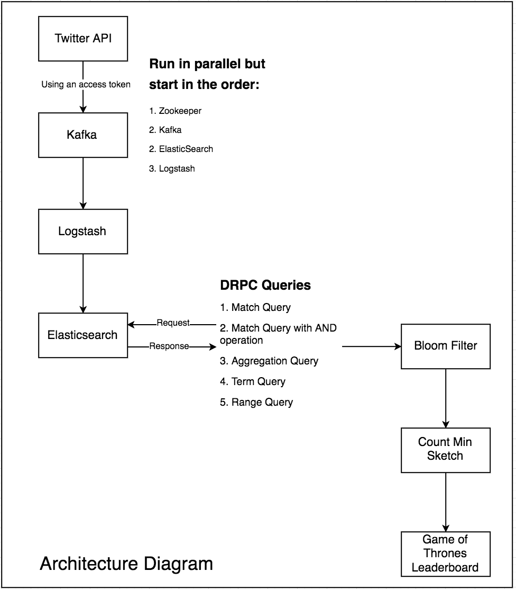

# CSC 591: Capstone Project
## Algorithms for Data Guided Business Intelligence

### Indexing and Searching for Hot Topics with ElasticSearch, Kafka, Count Min and Heavy Hitters

Elasticsearch and Kafka are popular data streaming softwares. Kafka is a high throughput, low latency platform for handling real time data feeds. Elasticsearch is a search engine that allows scalable searching which is almost real time, with a lag of mere seconds. These two components of our project have been connected using logstash which is a data collection engine with real time pipelining capabilities. We support five types of DRPC queries on the data indexed through Elasticsearch. A Bloom Filter and Count Min Sketch are applied to results from one of these queries to generate a leaderboard for popular Game of Thrones characters. DRPC, Bloom Filter and Count Min Sketches will be explained while you progress through the execution of this project. All softwares used in this project are open source.  

[Here](https://drive.google.com/open?id=1dFmIoR4C3l1t-gDheNUXPKaTLvs98cep) is a link to our project video.

It is easier to understand the architecture of this project diagrammatically.  

To run this project, you need to install various python libraries using the following command after cloning this repository:  
`cat requirements.txt | xargs sudo apt-get -y install`

The following softwares with their corresponding versions need to be installed using brew:  
&nbsp;&nbsp;&nbsp;&nbsp;&nbsp;&nbsp;&nbsp;&nbsp;`brew install elasticsearch@6.6.1`  
&nbsp;&nbsp;&nbsp;&nbsp;&nbsp;&nbsp;&nbsp;&nbsp;`brew install logstash@6.6.1`  
&nbsp;&nbsp;&nbsp;&nbsp;&nbsp;&nbsp;&nbsp;&nbsp;`brew cask install java`  
&nbsp;&nbsp;&nbsp;&nbsp;&nbsp;&nbsp;&nbsp;&nbsp;`brew install kafka`  

Once all the softwares are downloaded, start all the services in the order given below, in six different terminals. Be careful not to close any of these and maintain the order in which you start them, failing to do which would lead to erronous outputs.  

1. Start Zookeeper Server:  
    `zookeeper-server-start /usr/local/etc/kafka/zookeeper.properties`  

2. Start Kafka Server:  
    `kafka-server-start /usr/local/etc/kafka/server.properties`  

3. Now open [`twitter_to_kafka.ipynb`](https://github.ncsu.edu/rnarang/ADBI_Capstone/blob/master/twitter_to_kafka.ipynb) and run the cells one by one. This will fetch data from twitter and push it to kafka. The topic under which the tweets will be stored is called `got`.  

4. Now to check if the data is landing in Kafka, use this command:  
    `kafka-console-consumer --bootstrap-server localhost:9092 --topic got --from-beginning`  

5. Start ElasticSearch Server:  
    `elasticsearch`  
    Simultaneously, start Kibana:  
    `kibana`  
    
6. Now go to the logstash directory:  
`cd /usr/local/Cellar/logstash/6.6.1`  
First check if the configuration file is okay using this command:  
`bin/logstash -f twitterstream.conf --config.test_and_exit`  

7. Use the following logstash command for transferring data from Kafka to ElasticSearch:  
    `bin/logstash -f twitterstream.conf --config.reload.automatic`  

8. This will start indexing the tweets into elastic search. Go to kibana on `https://localhost:5601` in a web browser and check that our data is present there. Go to dev tools and run a match all query. See that we’ve got our data.

`‘’’
GET /got/_search
{
  "query": { "match_all": {} }
}
‘’’` 

9. Run the [`DRPC_ElasticSearch.ipynb`](https://github.ncsu.edu/rnarang/ADBI_Capstone/blob/master/DRPC_ElasticSearch.ipynb), execute each cell to see the results.  

&nbsp;&nbsp;&nbsp;&nbsp;&nbsp;&nbsp;&nbsp;&nbsp;We support five types of DRPC queries:  
&nbsp;&nbsp;&nbsp;&nbsp;&nbsp;&nbsp;&nbsp;&nbsp;&nbsp;&nbsp;&nbsp;&nbsp;i. Match Query  
&nbsp;&nbsp;&nbsp;&nbsp;&nbsp;&nbsp;&nbsp;&nbsp;&nbsp;&nbsp;&nbsp;&nbsp;ii. Match Query with AND operation  
&nbsp;&nbsp;&nbsp;&nbsp;&nbsp;&nbsp;&nbsp;&nbsp;&nbsp;&nbsp;&nbsp;&nbsp;iii. Aggregation Query  
&nbsp;&nbsp;&nbsp;&nbsp;&nbsp;&nbsp;&nbsp;&nbsp;&nbsp;&nbsp;&nbsp;&nbsp;iv. Term Query  
&nbsp;&nbsp;&nbsp;&nbsp;&nbsp;&nbsp;&nbsp;&nbsp;&nbsp;&nbsp;&nbsp;&nbsp;v. Range Query 

10. Run the [`CMS_BF_Application.ipynb`](https://github.ncsu.edu/rnarang/ADBI_Capstone/blob/master/CMS_BF/CMS_BF_Application.ipynb) to generate a leaderboard of 5 most popular Game of Thrones characters found in the last 1000 tweets from elasticsearch, updated every 5 seconds. 

### Final Screencast

[Screencast Video](https://drive.google.com/file/d/1dFmIoR4C3l1t-gDheNUXPKaTLvs98cep/view)

